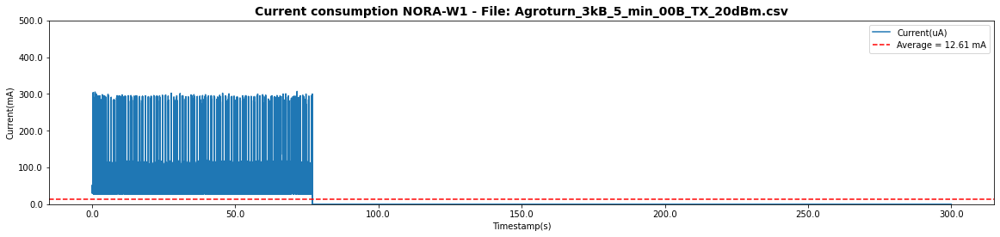
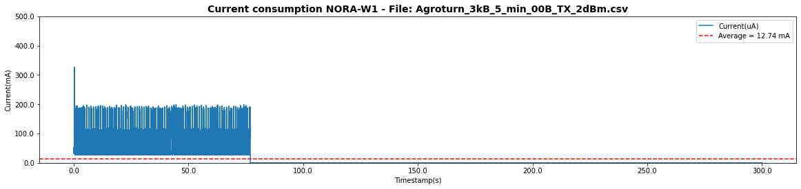
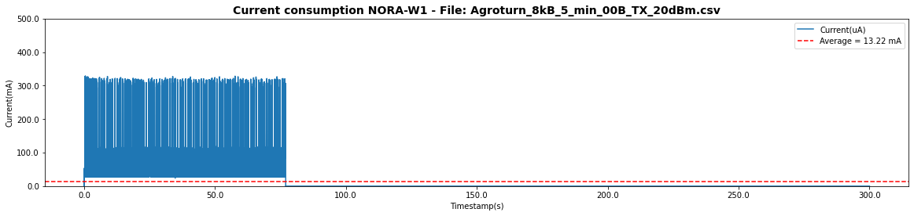
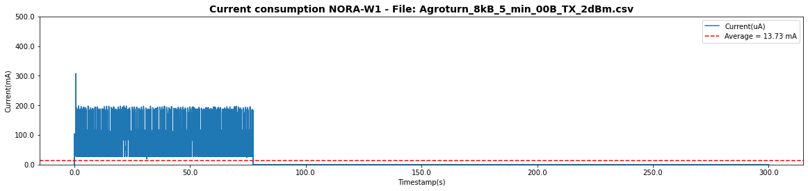

# Current consumption for NORA-W1 

## Description

Using the project simulation is poosible to check the current consumption for NORA-W1 for the scenario described below. Also, it is poosible to test how the TX power levels could affect their scenario.

So the question is, can the user control the TX levels on NORA-W1 to optimize the power consumption to the lowest possible?

## Hardware

NORA-W1 (ESP32-S3)

## ESP-IDF version

5.1.2

## Simulation description

Scenario 01:
- Simulation duration: 300 seconds (5 minutes)
- NORA-W1 is set in the Wi-Fi station mode and acts as a TCP client
- NORA-W1 transmits data periodically via TCP link:
    - 3 kilobytes each 1s for 75 seconds
- After transmitting data for 100 seconds, NORA-W1 goes to deep-sleep mode for 225 seconds
- TCP Server was created on the [TCP Debugger app](https://apps.microsoft.com/detail/9NWV1TCX232T?hl=en-us&gl=US).
    - Also, it was tested using the [YAT software](https://sourceforge.net/projects/y-a-terminal/).
- The module is set up to be online and responds to ping anytime.
- AP's beacon interval = 102400 us, DTIM period = 1

Scenario 02:
Same scenario 01, but with a different payload:
- NORA-W1 transmits data periodically via TCP link:
    - 8 kilobytes each 1s for 75 seconds

## Results

We ran different tests modifying the Payload and the TX power levels.

### Payload 3kB and TX power level 20 dBm

- Payload: 3kB
- TX power level: 20 dBm  (80)
- Test duration: 5min
- Current average: 12.61 mA

#### Current consumption estimation

- Consumption per hour: 12.61*60/5 = 151.32 mAh
- 24h: ~ 3.63 A
---

### Payload 3kB and TX power level 2 dBm

- Payload: 3kB
- TX power level: 2 dBm  (8)
- Test duration: 5min
- Current average: 12.74 mA

#### Current consumption estimation

- Consumption per hour: 12.74*60/5 = 152.88 mAh
- 24h: ~ 3.67 A
---

### Payload 8kB and TX power level 20 dBm

- Payload: 8kB
- TX power level: 20 dBm  (80)
- Test duration: 5min
- Current average: 13.22 mA

#### Current consumption estimation

- Consumption per hour: 13.22*60/5 = 158.64 mAh
- 24h: ~ 3.81 A
---

### Payload 8kB and TX power level 2 dBm

- Payload: 8kB
- TX power level: 2 dBm  (8)
- Test duration: 5min
- Current average: 13.73 mA

#### Current consumption estimation

- Consumption per hour: 13.73*60/5 = 164.76 mAh
- 24h: ~ 3.95 A
---