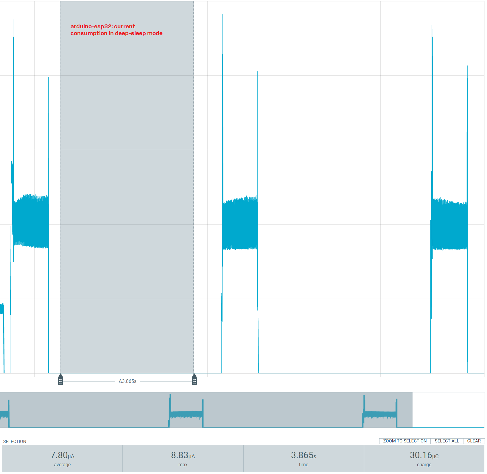
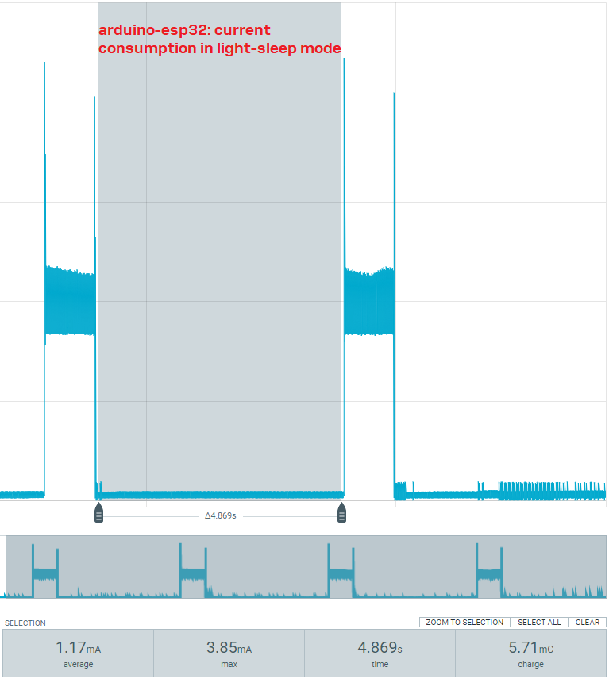

# Simulations using Arduino

We ran testes using Arduino IDE and flashing te code on the EXV-NORA-W101-00B.

There are two different codes: [Deep_sleep_TimerWakeUp](./Deep_sleep_TimerWakeUp/) and [Light_sleep_TimerWakeUp](./Light_sleep_TimerWakeUp/).

## About the examples

The codes are the examples provided by the manufacturers with some changes.

### Reference
 
 [ESP32 Arduino lib-builder](https://docs.espressif.com/projects/arduino-esp32/en/latest/esp-idf_component.html)

## Results for Arduino Code

| | Arduino code |
|-------------------|:-------:|
| Deep-sleep mode | 7.80 uA |
| Light-sleep mode | 1.17 mA |

### Current consumption - deep-sleep mode - Arduino code

### Current consumption - deep-sleep mode - Arduino code

### Conclusions

The explanation for the high current consmption on the Arduino code using the light-sleep mode could be because the Arduino-esp doesn't contain the CPU power-down low-level feature in their code. At least, on the date that the code was tested, it isn't possible to find it in their [code](https://github.com/espressif/arduino-esp32).
 
The [CPU power-down low-level feature](https://docs.espressif.com/projects/esp-idf/en/release-v4.4/esp32s3/api-reference/system/sleep_modes.html#_CPPv425esp_sleep_cpu_pd_low_initb) allows getting the current consumption value reported on the [ESP32-S3 datasheet](https://www.espressif.com/sites/default/files/documentation/esp32-s3_datasheet_en.pdf).