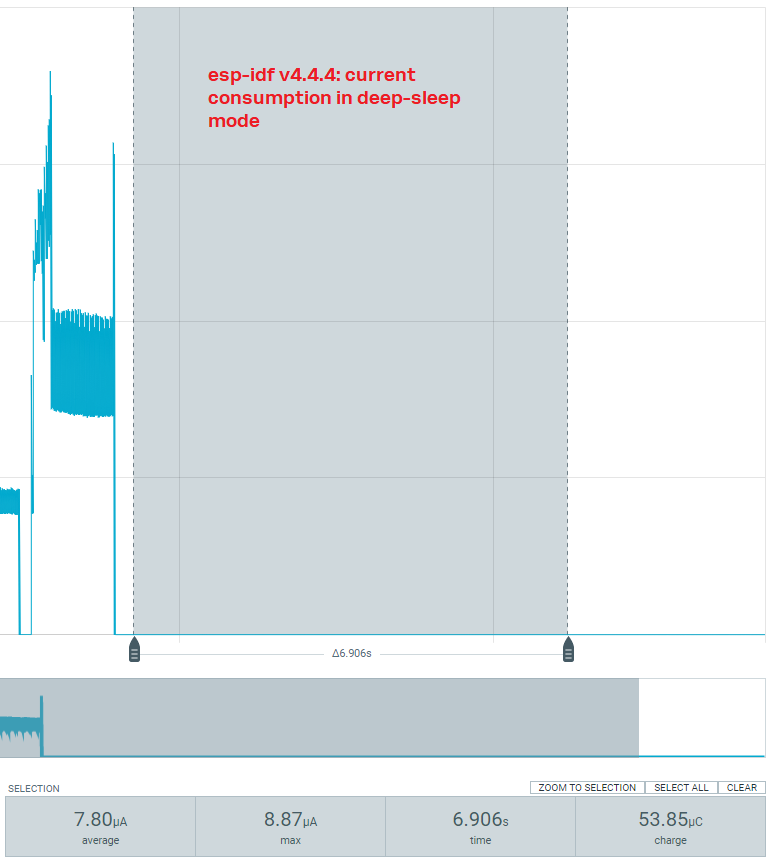
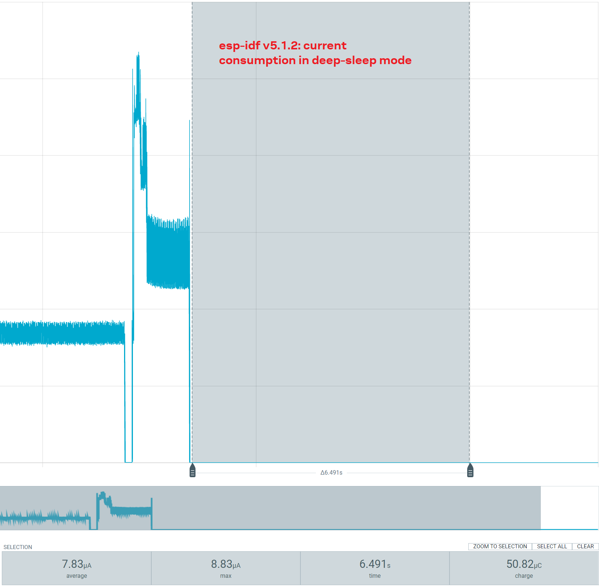
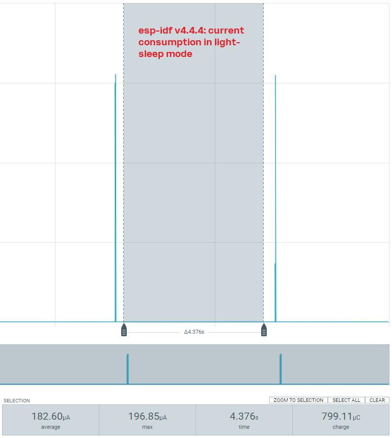
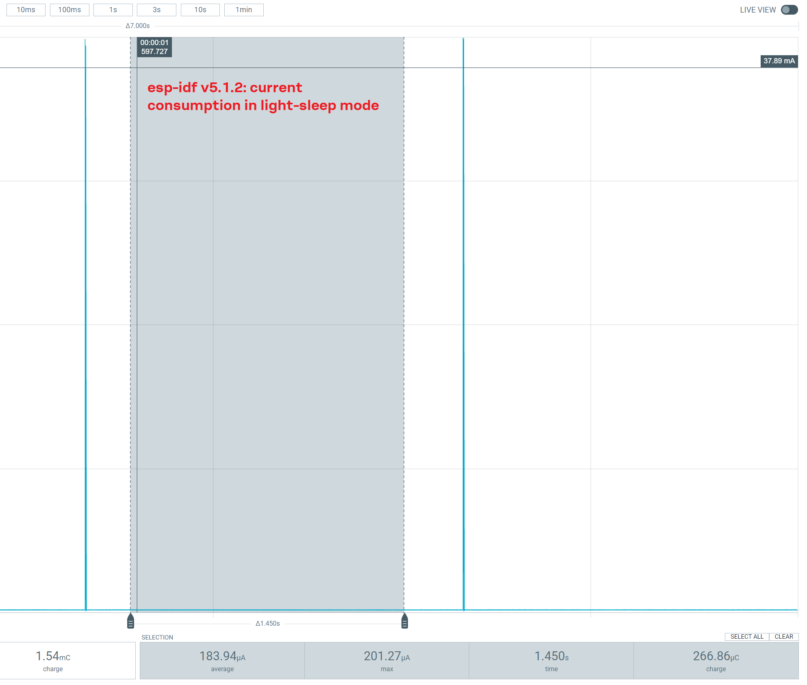

# Simulations using Espressif

We ran testes using the EXV-NORA-W101-00B in two applications: one using the esp-idf v5.1.2 and another using v4.4.4.

There are two different codes:
- [ESP-IDF v4.4.4](./v4.4.4):
    - [deep-sleep](./v4.4.4/deep_sleep/) and
    - [deep-sleep](./v4.4.4/light_sleep/).

- [ESP-IDF v5.1.2](./v5.1.2):
    - [deep-sleep](./v5.1.2/deep_sleep/) and
    - [deep-sleep](./v5.1.2/light_sleep/).

## About the examples

The codes are the examples provided by the manufacturers with some changes.

### Reference
 
 [Espressif Sleep Modes](https://docs.espressif.com/projects/esp-idf/en/v5.1.2/esp32/api-reference/system/sleep_modes.html)

## Results for Arduino Code

| | esp-idf 5.1.2 | esp-idf 4.4.4|
|-------------------|:-------:|:-------:|
| Deep-sleep mode | 7.83 uA | 7.80 uA |
| Light-sleep mode | 183.94 uA | 182.6 uA |

### Current consumption - deep-sleep mode - esp-if v4.4.4

### Current consumption - deep-sleep mode - esp-if v5.1.2

### Current consumption - light-sleep mode - esp-if v4.4.4

### Current consumption - light-sleep mode - esp-if v5.1.2

