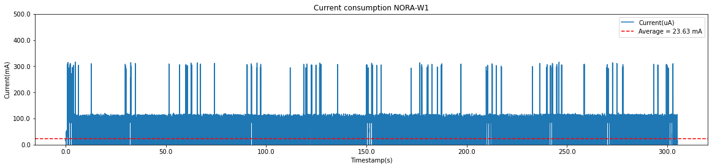

# Current consumption on NORA-W1 using power save mode

Power management algorithm included in ESP-IDF can adjust the advanced peripheral bus (APB) frequency, CPU frequency, and put the chip into Light-sleep mode to run an application at smallest possible power consumption, given the requirements of application components.

## Hardware

NORA-W1 (ESP32-S3)

## ESP-IDF version

5.1.2

## Simulation description

- Power save mode (automatic Light-sleep feature)
- References:
    - [Wi-Fi/Bluetooth and Sleep Modes](https://docs.espressif.com/projects/esp-idf/en/v5.1.2/esp32/api-reference/system/sleep_modes.html#wi-fi-bluetooth-and-sleep-modes)
    - [Power Management](https://docs.espressif.com/projects/esp-idf/en/v5.1.2/esp32s3/api-reference/system/power_management.html#power-management)
    - Espressif GitHub example: [Wi-Fi->Power Save](https://github.com/espressif/esp-idf/tree/v5.1.2/examples/wifi/power_save#readme)
- NORA-W1 transmits data periodically via TCP link:
    - 300bytes each 30s and
    - 2k each 5min
- NORA-W1 receives data aperiodically via TCP link:
    - 4x2.5k (Total 10k) [ESP32 Buffer limit = 4k]
- TCP Server was created on the [TCP Debugger app](https://apps.microsoft.com/detail/9NWV1TCX232T?hl=en-us&gl=US).
    - Also, it was tested using the YAT software.
- The module is set up to be online and responds to ping anytime.

## Results

- Test duration: 5min
- Current average: 23.63 mA

