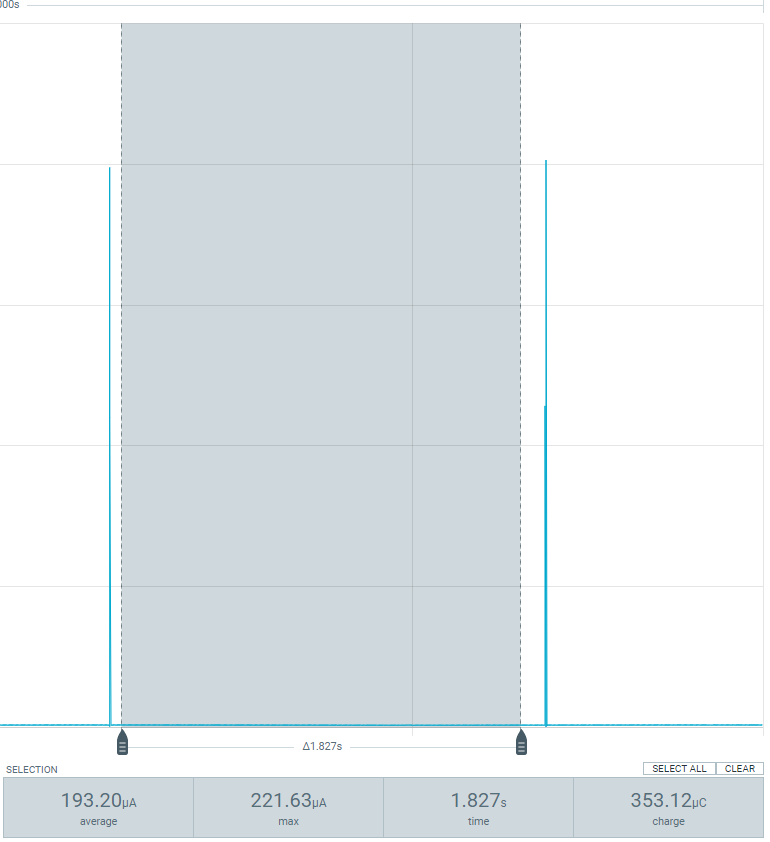
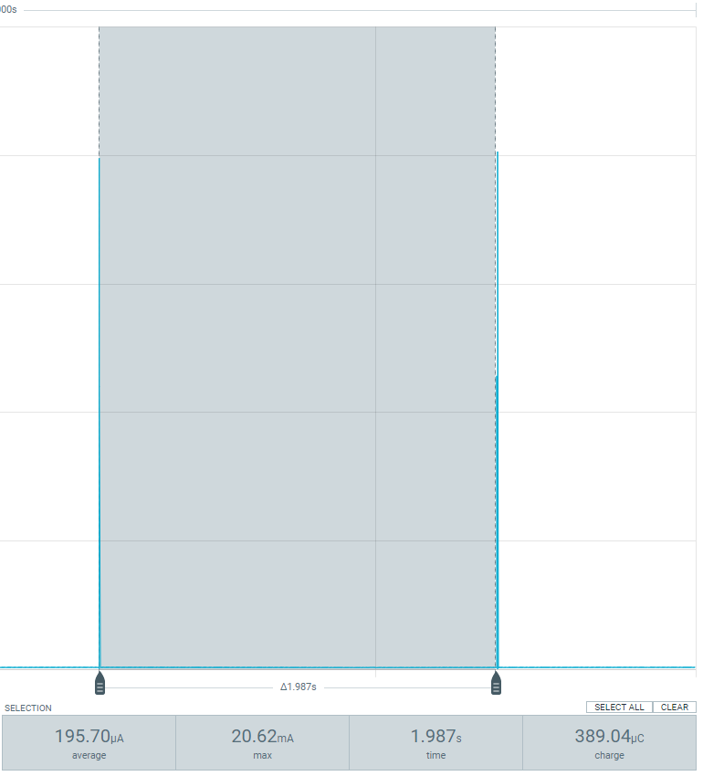

# Discrepancy in NORA-W1 light sleep mode current consumption

Investigaton about the current consumption on NORA-W1/W2 during the sleep modes.

## Hardware

NORA-W1/W2 (esp32-s3)

## ESP-IDF version

5.1.1

## Light Sleep Mode - NORA-W1

This code is based on [ESP example ligth_sleep](examples/system/light_sleep) and illustrates usage of light sleep mode for current consuption measurement. Unlike deep sleep mode, light sleep preserves the state of the memory, CPU, and peripherals. Execution of code on both CPUs is stopped when `esp_light_sleep_start()` function is called. When the chip exits light sleep mode, execution continues at the point where it was stopped, and `esp_light_sleep_start()` function returns.

The example enables the following wakeup source:

- Timer: wake up the chip in 2 seconds

## Solution description

To get the light-sleep mode report on the ESP datasheet, it is necessary enabling the following Kconfig options:

[CONFIG_PM_POWER_DOWN_CPU_IN_LIGHT_SLEEP](https://docs.espressif.com/projects/esp-idf/en/v5.1.1/esp32s3/api-reference/kconfig.html#config-pm-power-down-cpu-in-light-sleep) to allow the CPU to power down in light sleep.

[CONFIG_PM_POWER_DOWN_TAGMEM_IN_LIGHT_SLEEP](https://docs.espressif.com/projects/esp-idf/en/v5.1.1/esp32s3/api-reference/kconfig.html#config-pm-power-down-tagmem-in-light-sleep) to retain the I/D-cache tag memory during light sleep.

Note: Since the simulation is using the TIMER to wake up the CPU every 2 seconds, the following option is not enabled: [CONFIG_PM_POWER_DOWN_PERIPHERAL_IN_LIGHT_SLEEP](https://docs.espressif.com/projects/esp-idf/en/v5.1.1/esp32s3/api-reference/kconfig.html#config-pm-power-down-peripheral-in-light-sleep). 

Following the Espressif recommendation in step 3 of [this ticket](https://glab.espressif.cn/technical_support/ublox/ublox_190121/issues/118#note_43300), use the function [esp_sleep_cpu_pd_low_init](https://docs.espressif.com/projects/esp-idf/en/v5.1.1/esp32s3/api-reference/system/sleep_modes.html#_CPPv425esp_sleep_cpu_pd_low_initv) before entering the light sleep mode. On esp-idf v5.1.1, use the flowing instruction:

`ESP_ERROR_CHECK(esp_sleep_cpu_pd_low_init());`

## Results

Here are some screenshots of the current consumption in the light-sleep mode:

### Current consumption light-sleep mode

Average current consumption - light-sleep mode

### Current consumption light-sleep mode with the spike

Average current consumption with the spike - light-sleep mode

