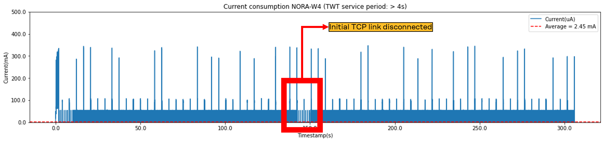

# Hardware

NORA-W4 (ESP32-C6)

# ESP-IDF version

5.1.2

# Simulation description

- Target Wake Time (TWT)
- References:
    - [ESP Wi-Fi](https://docs.espressif.com/projects/esp-idf/en/latest/esp32/api-reference/network/esp_wifi.html)
    - [Unleash the Power of Wi-Fi 6 with the ESP32-C6 Module](https://www.ineltek.co.uk/post/unleash-the-power-of-wi-fi-6-with-the-esp32-c6-module)
    - GitHub example: [Wi-Fi->itwt](https://github.com/espressif/esp-idf/tree/v5.1.2/examples/wifi/itwt#readme)
- Using Wi-Fi 6
- NORA-W4 transmits data periodically via TCP link:
    - 300bytes each 30s and
    - 2k each 5min
- NORA-W4 receives data aperiodically via TCP link:
    - 4x2.5k (Total 10k) [ESP32 Buffer limit = 4k]
- TCP Server was created on the [TCP Debugger app](https://apps.microsoft.com/detail/9NWV1TCX232T?hl=en-us&gl=US).
    - Also, it was tested using the YAT software.
- The module is set up to be online and responds to ping anytime.

# Results

We ran different tests modifying the TWT service period.

## TWT service period: 524.288 ms

- Test duration: 5 min
- TWT service period: 524.288 ms
- Current average: 12.54 mA

---

## TWT service period: 1.048576 s

- Test duration: 5 min
- TWT service period: 1.048576 s
- Current average: 12.54 mA

---

## TWT service period: 2.097152 s

- Test duration: 5 min
- TWT service period: 2.097152 s
- Current average: 12.54 mA

---

## TWT service period: 3.145728 s

- Test duration: 5 min
- TWT service period: 3.145728 s
- Current average: 12.54 mA

---

# Conclusions

- TWT service period is 4 s or up issues:
- Affects the task of receiving the 2.5k data from the TCP server.
    - Maybe it could be solved if we split the data into small packages.
- Disconnects the initial TCP link:

- Creates a new TCP link and keeps transmitting data

If the time constraints of the system are flexible (Soft Real-time system) and/or if the customer wants to transfer small data packets, it is possible to increase the TWT service period and test scenarios where the current consumption could reach lower levels.

# Extra simulation

Similar to the previous scenario, but without the receiving feature.
- <strike>NORA-W4 receives data aperiodically via TCP link:</strike> 
    - <strike>4x2.5k (Total 10k) [ESP32 Buffer limit = 4k]</strike>

- Test duration: 5 min
- TWT service period: 5.12 s
- Current average: 2.51  mA

