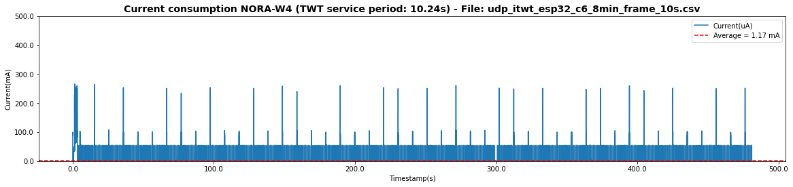
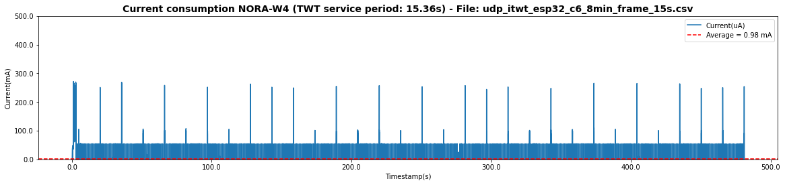

# Hardware

NORA-W4 (ESP32-C6)

# ESP-IDF version

5.1.2

# Simulation description

- Target Wake Time (TWT)
- References:
    - [ESP Wi-Fi](https://docs.espressif.com/projects/esp-idf/en/latest/esp32/api-reference/network/esp_wifi.html)
    - [Unleash the Power of Wi-Fi 6 with the ESP32-C6 Module](https://www.ineltek.co.uk/post/unleash-the-power-of-wi-fi-6-with-the-esp32-c6-module)
    - GitHub example: [Wi-Fi->itwt](https://github.com/espressif/esp-idf/tree/v5.1.2/examples/wifi/itwt#readme)
- Using Wi-Fi 6
- Ping/pong data periodically via UDP link:
    - 16 bytes each 2mi
- TCP Server was created on the [TCP Debugger app](https://apps.microsoft.com/detail/9NWV1TCX232T?hl=en-us&gl=US).
    - Also, it was tested using the YAT software.
- The module is set up to be online and responds to ping anytime.

# Results

We ran different tests modifying the TWT service period.

## TWT service period: 5.12 s

- Test duration: 8 min
- TWT service period: 5.12 s
- Current average: 1.76 mA
- Ping/pong message (payload size): 16 bytes
- NORA-W4 received 5 out of 5 messages

---

## TWT service period: 10.24 s

- Test duration: 8 min
- TWT service period: 10.24 s
- Current average: 1.17 mA
- Ping/pong message (payload size): 16 bytes
- NORA-W4 received 4 out of 5 messages (1 message from the server was lost)

---

## TWT service period: 15.36 s

- Test duration: 8 min
- TWT service period: 15.36 s
- Current average: 980 uA
- Ping/pong message (payload size): 16 bytes
- NORA-W4 received 1 out of 5 messages (4 messages from the server was lost)

---

# Extra simulation

Python script to create a UDP server: 
